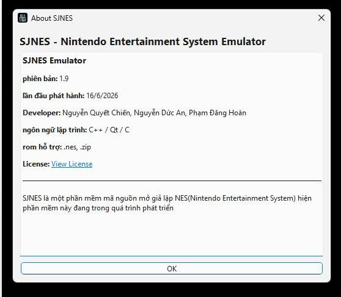

# SJNES

  

  <b>My first project: NES Emulator</b> 
  Developed by <b>Chiến</b>

## Introduction

SJNES is my first emulator project, built to simulate the Nintendo Entertainment System/Famicom. The project focuses on learning how the NES works internally, including the CPU, PPU, APU, cartridge system, memory bus, controllers, and mappers.

The goal of SJNES is not only to run NES games, but also to help me understand low-level programming, emulator architecture, graphics rendering, audio generation, memory mapping, and software debugging.

## Features

- Open and run NES ROM files.
- Emulate the NES CPU based on the 6502 processor.
- Emulate PPU graphics rendering.
- Emulate APU audio channels.
- Support keyboard input for controller controls.
- Support multiple NES mappers.
- Qt-based graphical user interface.
- Basic actions such as reset, pause, and fast forward.
- Audio debug tools and waveform display.
- Channel mute options for testing audio.

## Main Components

### CPU

SJNES emulates the NES CPU, including registers, status flags, addressing modes, instruction execution, interrupts, stack behavior, and memory access.

### PPU

The PPU handles the visual output of the NES. SJNES implements background rendering, sprite rendering, palettes, nametables, pattern tables, scrolling, and NMI behavior.

### APU

The APU is responsible for sound generation. SJNES supports the main NES audio channels, including Pulse 1, Pulse 2, Triangle, Noise, and DMC.

### Mapper

NES cartridges use mappers to extend the console's capabilities. SJNES supports several common mappers such as NROM, MMC1, UxROM, CNROM, MMC3, MMC5, AxROM, MMC2, VRC6, and others.

### User Interface

SJNES uses Qt for the graphical interface. The interface includes ROM loading, reset, pause, audio options, debug information, and waveform visualization.

## Technologies Used

- C++
- Qt
- Visual Studio
- Git/GitHub

## Screenshots

## Author

   
  <b>Chiến</b> 
  Developer of SJNES

This is my first project, a NES emulator created for learning, research, and software development practice.

## Special Thanks

Special thanks to:

- OLC Javidx9 / OneLoneCoder
- SourMesen
- NESDev community

Their resources and emulator references helped me understand NES emulation better.

## Project Status

SJNES is still in development. Some games can run, but accuracy may depend on the game, mapper, CPU timing, PPU behavior, and APU implementation.

## Future Improvements

- Improve CPU, PPU, and APU accuracy.
- Add more mapper support.
- Improve audio synchronization.
- Add save states for more mappers.
- Optimize performance for low-end computers.
- Improve debug tools.
- Add controller support.
- Add CRT shader or visual effects.

## Conclusion

SJNES is a learning-focused NES emulator project. Through this project, I learned more about C++, Qt, computer architecture, graphics processing, audio processing, memory management, and emulator development.
